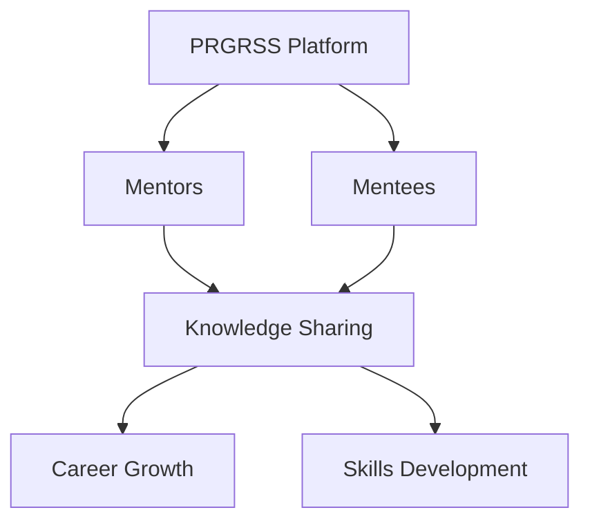
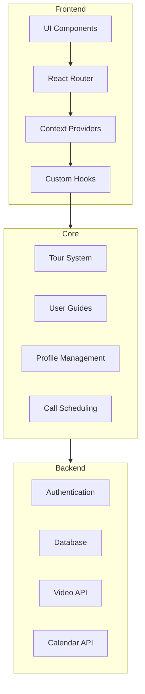
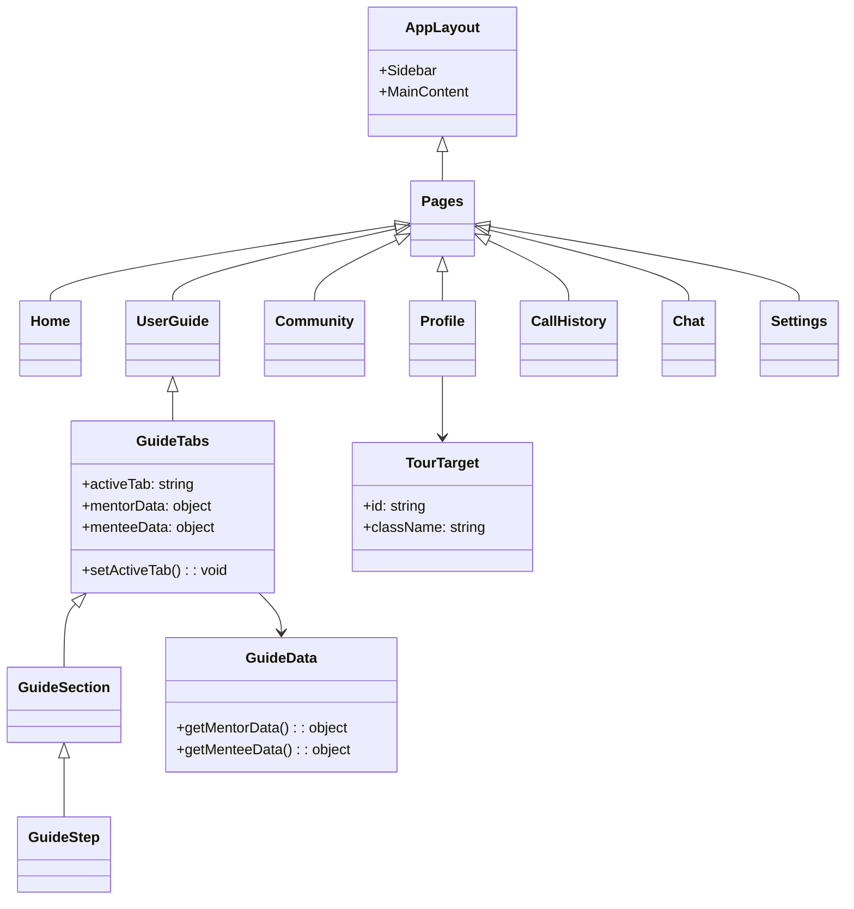
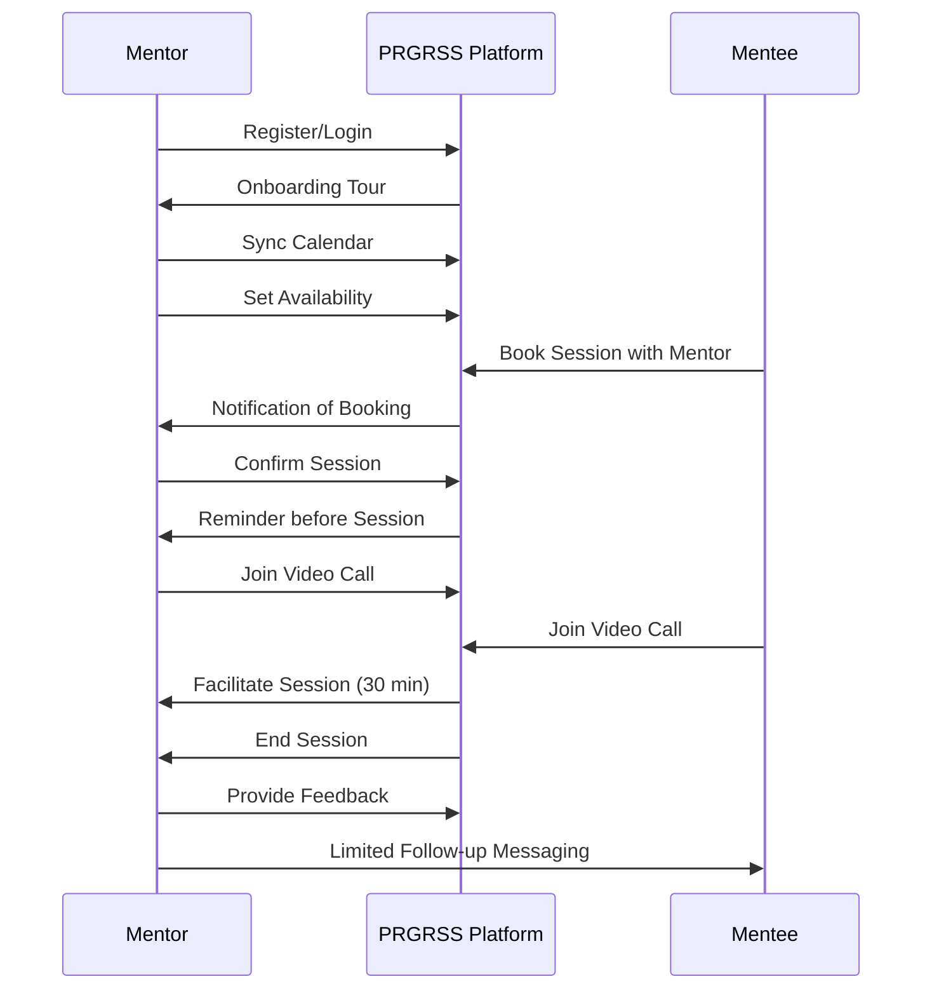
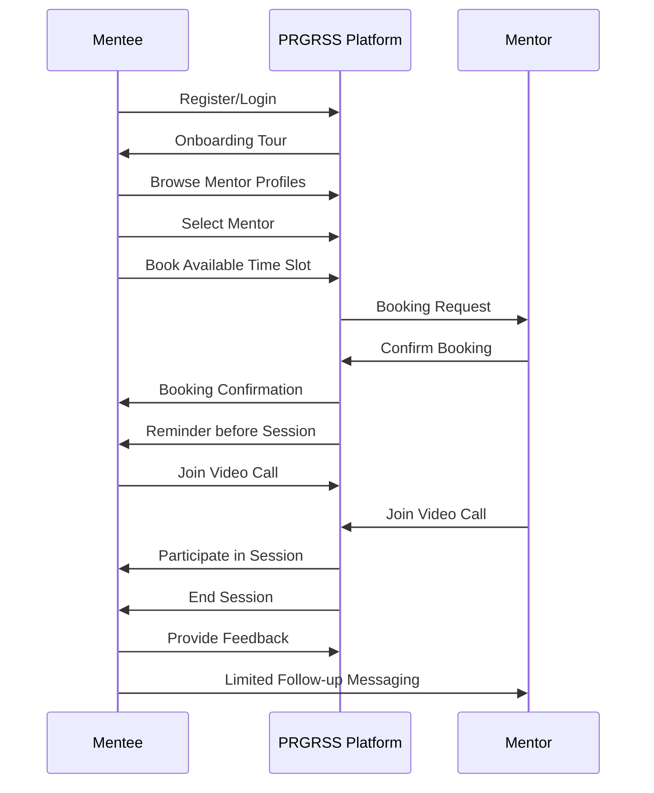
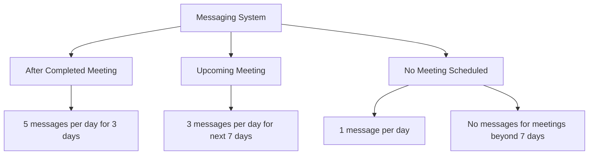

# PRGRSS Micro-Mentorship Platform



## 📋 Overview

PRGRSS is a comprehensive micro-mentorship platform designed to connect experienced industry professionals (mentors) with aspiring talents (mentees) in a structured, time-efficient manner. The platform facilitates meaningful connections through scheduled calls, messaging, and feedback systems while maintaining clear boundaries and expectations for both parties.

### Core Mission

To democratize access to career guidance and professional development through short, focused mentorship interactions that deliver maximum value with minimal time commitment.

## 🌟 Key Features

### For Mentors
- Calendar synchronization for availability management
- Scheduled video calls with mentees
- Post-session feedback collection
- Direct messaging with mentees (with reasonable limitations)
- Monthly booking quotas (3-10 calls)

### For Mentees
- Mentor discovery and matching
- Call booking and management (limit of 2 per month)
- Structured video sessions
- Post-session feedback submission
- Limited direct messaging with mentors

### Platform Features
- Interactive user onboarding tour
- Comprehensive user guides
- Community engagement tools
- Call history tracking
- Profile management

## 🏗️ Architecture



### Component Structure



## 🔄 User Flows

### Mentor Journey



### Mentee Journey



## 💬 Messaging System

The PRGRSS platform includes a carefully designed messaging system with limits to ensure productive interactions:



### Mentor Messaging Limits
- After completed meeting: 5 messages per day for 3 days
- Upcoming meeting: 3 messages per day if scheduled within next 7 days
- No meetings scheduled: 1 message per day
- Meeting beyond next 7 days: No messages allowed

### Mentee Messaging Limits
- After completed meeting: 5 messages per day for 3 days
- Upcoming meeting: 3 messages per day if scheduled within next 7 days
- If mentor messaged in last 3 days: 3 messages per day
- Meeting beyond next 7 days: No messages allowed

## 🎨 Brand & Design

PRGRSS features a modern, professional design system with:

- Dark mode interface with accent colors
- Clean, accessible typography
- Interactive UI elements with subtle animations
- Consistent shadcn/ui component library implementation
- Mobile-responsive design

## 🚀 Installation & Setup

```bash
# Clone the repository
git clone <repository-url>

# Navigate to project directory
cd prgrss-platform

# Install dependencies
npm install

# Start development server
npm run dev
```

## 💻 Development Guidelines

### Technology Stack
- React with TypeScript
- Vite for build tooling
- Tailwind CSS for styling
- shadcn/ui component library
- Framer Motion for animations
- Tanstack React Query for data fetching
- React Router for navigation

### Code Organization
- `/src/components` - Reusable UI components
- `/src/pages` - Route-level page components
- `/src/hooks` - Custom React hooks
- `/src/contexts` - React Context providers
- `/src/lib` - Utility functions and helpers
- `/src/types` - TypeScript type definitions

### Best Practices
- Component-based architecture
- TypeScript for type safety
- Mobile-first responsive design
- Accessibility-minded development
- Consistent error handling
- Code commenting and documentation

## 🤝 Contributing

Contributions to PRGRSS are welcome! Please follow these steps:

1. Fork the repository
2. Create a feature branch (`git checkout -b feature/amazing-feature`)
3. Commit your changes (`git commit -m 'Add some amazing feature'`)
4. Push to the branch (`git push origin feature/amazing-feature`)
5. Open a Pull Request

## 📄 License

This project is licensed under the MIT License - see the LICENSE file for details.

## 🙏 Acknowledgements

- All mentors contributing their time and expertise
- Our community of mentees seeking growth opportunities
- The development team behind the PRGRSS platform
- Open source libraries and tools that make this platform possible
