# PRGRSS - Micro-Mentorship Platform


## Overview
PRGRSS is a premium micro-mentorship platform designed to connect mentees with corporate mentors through focused, time-boxed interactions. The platform facilitates 12-minute video calls with structured pre and post-session buffers, ensuring efficient and productive mentoring experiences. With a sophisticated black and gold aesthetic, PRGRSS creates an exclusive yet approachable environment for professional development.

## Key Features
- **Micro-Mentorship Sessions**: Precisely timed 12-minute video calls
- **Role-Based Experience**: Tailored interfaces and rules for mentors and mentees
- **Interactive User Guide**: Comprehensive documentation for both user types
- **Guided Tour Experience**: Interactive walkthrough of platform features
- **Messaging System**: Controlled communication based on relationship status
- **Calendar Integration**: Seamless scheduling and availability management
- **Detailed Feedback System**: Post-session evaluation mechanism
- **Premium Aesthetic**: Black and gold color scheme with glass effects

## Application Architecture


## User Flow


## Messaging System Flow


## Platform Limitations

```mermaid
graph TD
    subgraph "Call Management Limits"
        A1[Mentor: 3-10 calls/month]
        A2[Mentee: 2 calls/month]
        A3[Mentor: 5 reschedules/month]
        A4[Mentee: 2 reschedules/month]
        A5[Mentor: 4 cancellations/month]
        A6[Mentee: 2 cancellations/month]
    end
    
    subgraph "Messaging Limits"
        B1[After Call: 5 msgs/day for 3 days]
        B2[Upcoming Call: 3 msgs/day if within 7 days]
        B3[No Call - Mentor: 1 msg/day]
        B4[No Call - Mentee: 3 msgs/day if mentor initiated]
        B5[Call beyond 7 days: No messages]
    end
    
    subgraph "Call Session Rules"
        C1[Earliest Join: 15 seconds before call]
        C2[Latest Join: 5 minutes after start]
        C3[Mentor No-Show: Blocked for 30 days after 2 no-shows]
        C4[Mentee No-Show: Blocked for 60 days after 1 no-show]
    end
```



## Component Structure


## Technology Stack
- **Frontend Framework**: React with TypeScript
- **Routing**: React Router DOM
- **UI Components**: Custom components with Shadcn UI
- **Styling**: Tailwind CSS for utility-first styling
- **Animations**: Framer Motion for smooth transitions
- **Gesture Handling**: react-swipeable for touch interactions
- **Icons**: Lucide React for consistent iconography
- **Build Tool**: Vite for fast development and optimized production builds

## Brand Guidelines
PRGRSS features a premium, sophisticated aesthetic with a minimalist dark theme and gold/champagne accents, creating a high-end, exclusive atmosphere.

### Color Palette
#### Primary Colors
- Black (#000000): Background color, creates an elegant canvas
- Gold/Champagne (#E5B884): Primary accent color for interactive elements
- White (#FFFFFF): Main text color for maximum readability

#### Secondary Colors
- Dark Gray (#2A2A2A): Secondary background for cards and panels
- Medium Gray (#333333): For muted elements
- Light Gray (#888888): For secondary and tertiary text
- Card Background (rgba(42, 42, 42, 0.8)): Semi-transparent for glass effect
- Destructive Red (hsl(0, 62.8%, 30.6%)): For error states

### Typography
- **Font Family**: Inter (sans-serif)
- Clean, modern sans-serif typeface with high readability

### Visual Effects
- **Glass Effect**: Semi-transparent backgrounds with blur
- **Gradients**: Subtle card overlays
- **Animations**: Card transitions and hover effects

## Tour System Architecture
The tour system leverages React's Context API to manage state and provide a guided experience to users:


## Installation and Setup

```bash
# Clone the repository
git clone <repository-url>

# Navigate to the project directory
cd prgrss-app

# Install dependencies
npm install

# Start the development server
npm run dev
```

## Development Guidelines
### Component Structure:
- Keep components small and focused on a single responsibility
- Use the TourTarget wrapper for elements that need to be highlighted in the tour

### Styling Approach:
- Follow the established color palette
- Utilize Tailwind utility classes
- Maintain the glass effect aesthetic for cards and overlays

### Animation Standards:
- Use Framer Motion for consistent animations
- Keep transitions subtle and professional

### Tour System:
- Register new tour targets using the TourTarget component
- Add new tour steps in the TourContext.tsx file

## Messaging System Implementation
The messaging system follows a LinkedIn-like connection model where users can only message each other after booking or completing a call. Message limits vary based on the relationship status:

### After completing a call:
- 5 messages per day for 3 days for both mentors and mentees

### With upcoming call scheduled:
- 3 messages per day if the call is within the next 7 days
- No messages allowed if the call is beyond 7 days

### Without scheduled calls:
- Mentors can send 1 message per day
- Mentees can send 3 messages per day only if the mentor messaged first

## Call Management Rules
### Call Limits:
- Mentors: 3-10 calls per month (customizable)
- Mentees: 2 calls per month

### Call Duration:
- 12 minutes per session
- 5-minute buffer before call
- 3-minute buffer after call

### Rescheduling Limits:
- Mentors: 5 reschedules per month
- Mentees: 2 reschedules per month

### No-Show Policy:
- Mentors: Blocked for 30 days after 2 no-shows within 30 days
- Mentees: Blocked for 60 days after 1 no-show within 60 days

### Join Rules:
- Earliest join time: 15 seconds before scheduled start
- Latest join time: 5 minutes after scheduled start

## Contributing
When contributing to this project, please follow these guidelines:

- Follow the established code structure and naming conventions
- Maintain the premium aesthetic defined in the brand guidelines
- Ensure all new features support both mentor and mentee user types
- Test thoroughly across different device sizes
- Document any changes to the tour system or messaging rules

## License
© 2025 PRGRSS. All rights reserved.
